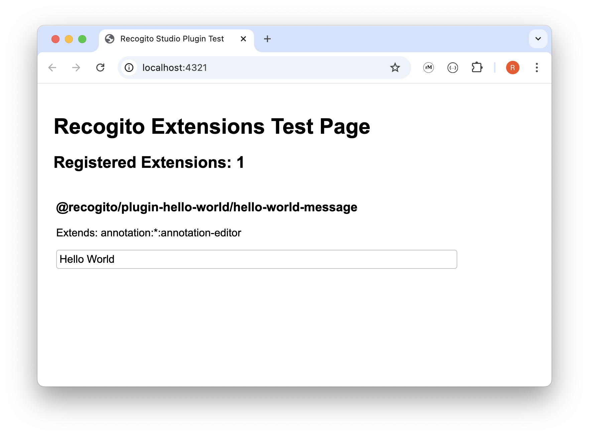

# plugin-hello-world

A 'Hello World' Recogito Studio plugin. This project will introduce you to the basics of building your own plugins for the [Recogito Studio Client](https://github.com/recogito/recogito-client).

## Prerequisites

Make sure you have the following installed:

- NodeJS (version 20 recommended)
- npm

## Getting Started

1. Clone this repository.
2. Run `npm install` to install dependencies.
3. Run `npm run build` to build the plugin.
4. Run `npm run dev` to preview the built plugin in the Recogito Test application.
5. Point your browser to <http://localhost:4321/>. You should see the UI extensions test page:

> Note that this plugin was created following steps 1 - 7 of the [Recogito Studio SDK documentation](https://github.com/recogito/recogito-studio-sdk). 

## What's Next?

Use this project as a starting point for creating your own Recogito Studio plugins.

- To learn more about plugins that provide UI extensions, [see this example](https://github.com/recogito/plugin-reconciliation-service).
- To learn more about plugins that add API routes, [see this example](https://github.com/recogito/plugin-duke-unreal-export).
